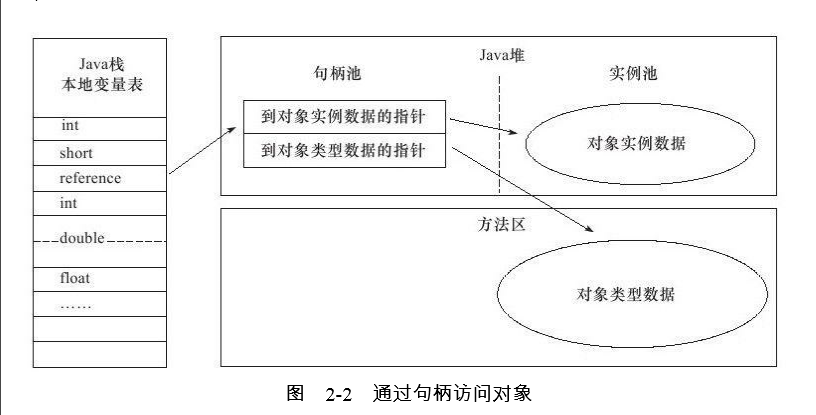
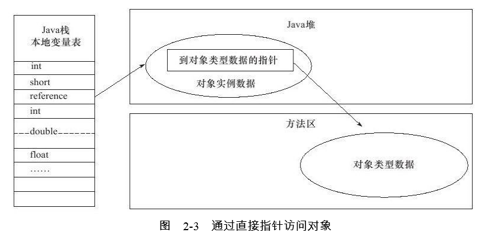

## JVM自动内存管理机制部分
***
### JAVA内存区域与内存区异常--学习笔记总结
----------------
#### Java虚拟机运行时数据区

1. 线程私有：
  *  程序计数器(Program Counter Register) ：记录当前线程所执行的字节码的行号指示器（字节码解释器就是通过改变这个计数器的值来选择需要执行的字节码指令），每一个线程都需要一个独立的程序计数器，互不影响独立存储来保证线程操作。线程执行Java方法，记录正在执行的虚拟机字节码指令的地址，执行的Native方法，则计数器为空。 不存在OOMError。
  * Java虚拟机栈（Stack）:虚拟机栈描述JAVA方法执行的内存模型，每个方法执行的同时会创建一个栈帧（Stack Frame），存储局部变量表（局部变量表存储了编译器可知的局部基本数据类型、对象引用、ReturnAddress类型指向了一条字节码的地址）、操作数栈、动态链接、方法出口等信息。如果线程请求的栈深度大于虚拟机允许的最大深度，则抛出StackOverflowError异常，虚拟机扩展的时候无法申请到足够内存则抛出OutofMemoryError异常。
  * 本地方法区（Native Method Stack）： 本地方法区间与虚拟机栈类似，存储虚拟机使用到的Native方法服务，存在StackOverflowError与OutofMemoryError异常。
2. 线程共享
  * JAVA堆（Heap）：虚拟机启动时创建，存放对象实例，是垃圾收集器管理的主要区域（Garbage Collected Heap），又名GC 堆。从内存回收角度可以分为老年代和新生代，JAVA堆可以存在与物理上不连续的内存空间，只要逻辑上是连续的即可，通过 -Xmx -Xms 进行扩展和实现。堆无法扩展的时候将会抛出OutofMemoryError异常。
  * 方法区(Method Area|Non-heap)：存储已经被虚拟机加载的类信息 、常量、静态常量、即时编译器编译后的代码等数据。也被称为永久代，这区域主要是对常量池的回收和对类型的卸载，当方法区无法满足内存分配会抛出OutofMemoryError异常。
  * 运行时常量池（runtime Constant pool）：是方法区的一部分，Class文件中除了有类的版本、字段、方法、接口等描述信息，还存在有常量池，用于存放编译期生成的各种字面量和符号引用。受到方法区限制，存在OutofMemoryError异常。
3. 直接内存（Direct Memory）：并不属于虚拟机运行数据区的一部分，也不是JAVA虚拟机中规范的内存区域，但是被频繁使用会出现OutofMemoryError异常
***
#### HotSpot对象揭秘
1. 对象的创建

   虚拟机遇到一个New命令，首先检查是否能在常量池定位一个类的引用，并且检查该类是否被加载、解析和初始化，没有则必须进行类加载。

   加载检查通过之后，虚拟机为新生对象分配内存（指针碰撞和空闲列表）。需要保证分配内存的原子性（对分配内存空间的动作进行同步处理，采用CAS配上失败重试的方式或者根据不哦给你的线程划分在不同的空间上进行，称为本地线程分配缓冲，Thread Local Allocation Buffer ,TLAB）  

   内存分配完成之后，虚拟机需要将分配的内存空间都初始化为零值，不包括对象头，保证对象可以不赋值就可以直接使用，程序访问到的数据类型的零值。

   虚拟机对对象进行必要的设置，比如对象是哪个类的实例，如果才能找到类的元数据信息，对象的哈希码，对象的GC分代年龄等信息。

   从虚拟机的角度对象已经创建完成了，但从JAVA程序的视角，对象创建后需要执行init方法，按照需要进行初始化。
2. 对象的内存布局

   对象在内存存储的布局可以分为3快区域：对象头（Header）、实例数据（Instance Data）、对齐填充（Padding）。

   * 对象头又包含两个部分，第一个部分存储自身运行时数据，包括哈希码、GC分代年龄、锁状态标识、线程持有锁、偏向线程ID、偏向时间戳。第二部分是类型指针，即对象指向他的类元数据的指针，虚拟机根据该指针确定是哪个类的实例（如果是数组还需要存储数据的长度）。

  *  对象的实例数据部分是对象真正存储的有效信息，也就是程序中定义的各种字段，受到虚拟机分配策略参数FiledsAllocationStyle和字段在Java源码中的定义顺序影响。

  * 对齐填充并不是必然存在，对于Hotspot来说，对象的起始地址必须是8字节的整数倍，对象头正好是8字节的倍数，当实例数据数据部分没有对齐的时候，就需要对齐填充来进行补全。

3. 对象的访问定位

   JAVA程序通过栈上的reference数据来操作堆上的具体数据。reference类型在Java虚拟机规范中只规定了指向对象的应用，该引用如何访问到数据取决与虚拟机的实现，目前有使用句柄和直接访问两种方式。
   * 句柄访问：JAVA堆里面会划分出来一块内存作为句柄池，reference里面存储的就是对象的句柄地址。优点是对象移动的时候只需要改变句柄中的指针，reference数据不变。

   

   * 直接访问：需要考虑如果访问对象的类型数据,优点是减少了一次实例数据的指针定位开销。

   
4. 实战：OutofMemoryError异常

  * Java堆溢出 -Xmx -Xms  HeadDumpOnOutofMemoryError 出现异常可以转存出当前堆的内存快照进行事后分析。区分是内存泄漏（Memory Leak）还是内存溢出（Memory overflow）。
  * 虚拟机栈和本地方法区溢出：-Xss参数减少栈的内存容量
  如果线程请求的栈深度超过虚拟机所允许的最大深度，将抛出StackOverflowError异常
  如果虚拟机在扩展栈的时候无法申请到足够的内存空间，将抛出OutofMemoryError异常。单线程模式下内存无法分配的情况下都是StackOverflowError异常。在多线程模式下，线程数与每个线程分配栈分配内存反向变化。
  * 方法区和运行时常量池溢出，由于分配在永久代，可以通过-XX：PermSize和-XX：MaxPermSize限制方法区大小。
  * 本地直接内存溢出：DirectMemory，可以通过-XX:MaxDirecMemory指定。

****
#### 总结

   了解了虚拟机中的内存是如何划分的，哪部分区域、什么样的操作可能导致内存溢出异常。
   这一个部分主要的基础概念内容比较多，笔记基本上相当于写了一遍书中的内容，总结写完对具体内容还记的不是特别的清晰。以后看书到相应的章节需要再一次深入理解了。
   --2017年8月20日
